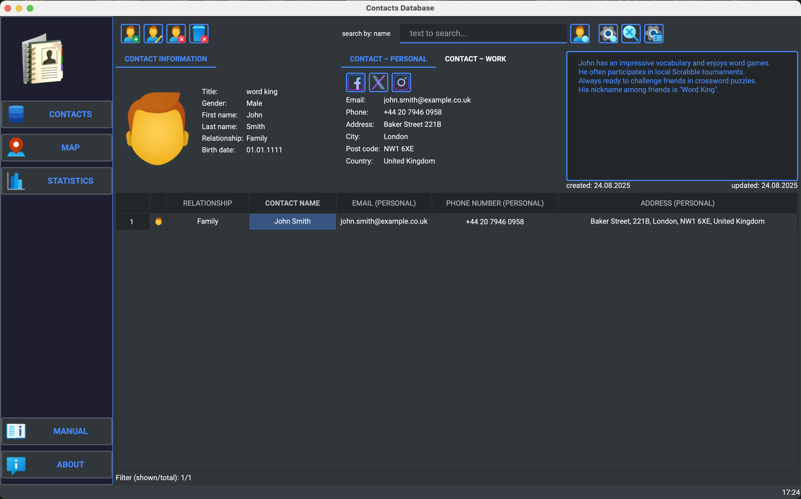

# ContactBookPro

A simple contact management application built with PyQt6, featuring location-based support and statistics.  
The application allows you to manage contacts, visualize locations on a map, and view basic statistics.

## Features

- Manage contacts with detailed information.
- Add location data to each contact and view it on a map.
- View simple statistics about contacts, such as how many are from family, work, etc.
- Interactive user interface built with PyQt6.
- Designed for easy scalability and additional features in the future.

## Screenshot

*Main window of the ContactBookPro application showing the contact list and toolbar menu.*


## Installation

(Tested on Windows / macOS, IDE: VS Code, PyCharm)

- Clone the repository:
```bash
    git clone https://github.com/Jin-Mach/ContactBookPro.git
```

- Navigate to the project directory:
```bash
    cd ContactBookPro
```

- Create a virtual environment:
  - On Windows
  ```bash
  python -m venv .venv
  ```
  - On macOS/Linux
  ```bash
  python3 -m venv .venv
  ```

- Activate the virtual environment:
  - On Windows (Command Prompt): 
  ```bash
  .venv\Scripts\activate
  ```
  - On Windows (PowerShell):
  ```bash
  .venv\Scripts\activate.ps1
  ```
  - On macOS/Linux:
  ```bash
  source .venv/bin/activate
  ```

- Install the required packages:
```bash
  pip install -r requirements.txt
```

## Usage
After installing the dependencies, you can start the application with the following command:

- Run the application:
  - On Windows
  ```bash
  python contact_book.py
  ```
  - On macOS/Linux
  ```bash
  python3 contact_book.py
  ```

## License

- This project is licensed under the MIT License.

## Credits
- Icons used in this project are provided by [Icons8](https://icons8.com/).

## Contact
- If you have any questions or feedback, feel free to reach out via my GitHub profile: [Jin-Mach](https://github.com/Jin-Mach).